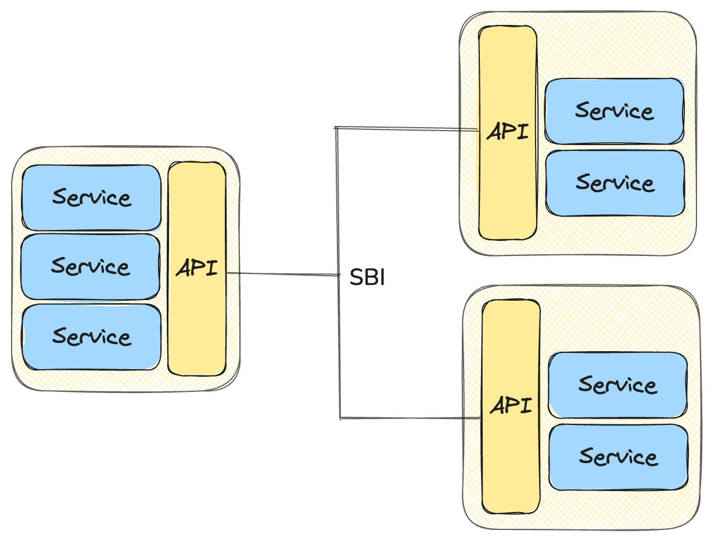
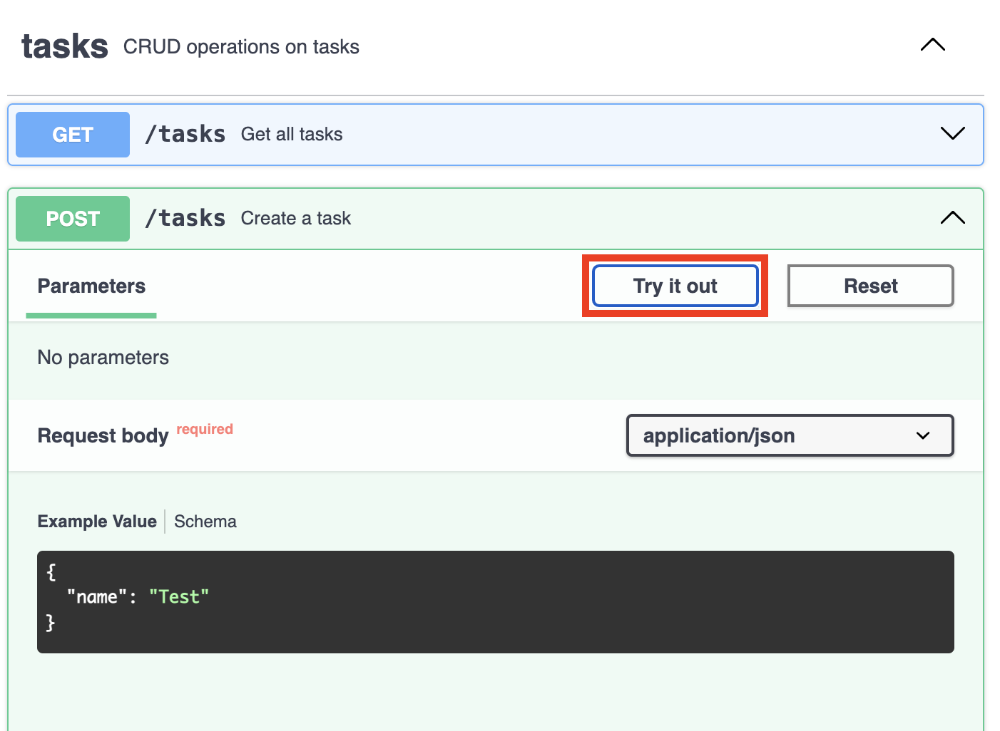
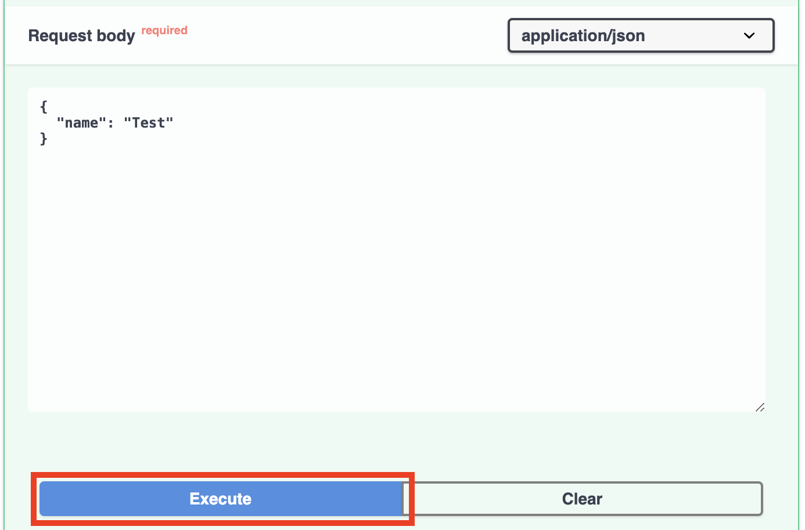
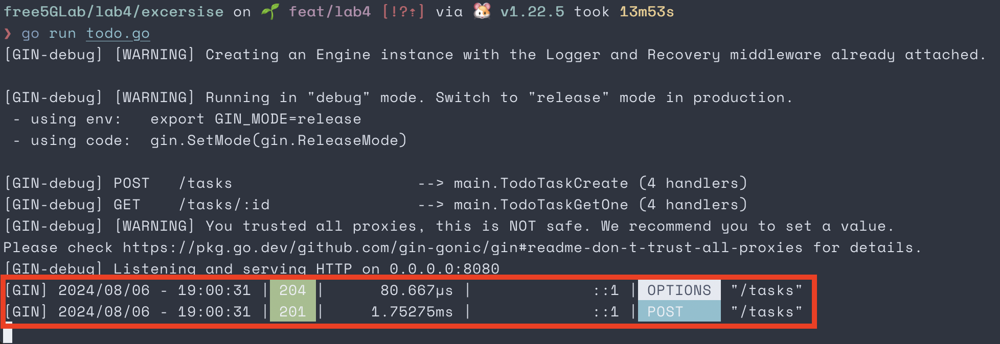

# Lab 4: Service-based Architecture (HTTP Protocol)

## Overview

## Service-Based Architecture (SBA) vs. Service-Oriented Architecture (SOA)

If you search for "service-based architecture" on Google, you will find SOA (service-oriented architecture) as the most popular term. However, they are quite different. SOA is an organizational architecture, whereas service-based architecture is a software architecture. SOA describes the entire system an organization provides to its customers, while service-based architecture describes services in the individual application that make up the system. In this lab, we will focus on service-based architecture.

### What does service-based architecture mean?

Service-based architecture is a software architecture that is based on the idea of services. An application is composed of a set of services. Each service is responsible for a specific set of tasks and should provides an interface for clients to interact with it. For example, a *todo-list* application may have a service for managing tasks, a service for managing users. Clients can interact with the application by sending requests (e.g., creating a task) to the services.

### SBA in 3GPP

In the context of 3GPP, a network function is an application that provides a set of services to the network. A 5G network is composed of a set of network functions. Each network function is responsible for a specific set of services. For example, AMF (Access and Mobility Management Function) is responsible for the access and mobility management of the network, SMF (Session Management Function) is responsible for the management of sessions.

To speed up the development of the network function, the 3GPP has specified a set of design principles for the development of network functions. One of them is that client interface of the services should designed as RESTful APIs (Application Programming Interfaces, that allows two applications to communicate with each other). Since services are reusable to every NF, this interface is also called **Service-Based Interface (SBI)**.



## RESTful API

We have mentioned that SBA should be designed as RESTful APIs, but what is RESTful API?

> REST (representational state transfer) is a software architectural style that was created to guide the design and development of the architecture for the World Wide Web.
--- **[Wikipedia](https://en.wikipedia.org/wiki/Representational_state_transfer)**

Representational means that the client and server communicate using data representations, such as JSON or XML. The data representations includes the state transitions. As a result, a RESTful API is an interface that changes the state of resources in the system. For example, in a todo-list application, the client can create, read, update and delete a new task. These operations together are called **CRUD (create, read, update, delete)**.

### HTTP Protocol

How to build a RESTful API? The most common way to build a RESTful API is to use HTTP protocol.

HTTP is a protocol that is used to transfer data over the internet, such as web pages, files. Most importantly, HTTP is stateless. This means that the client and server do not need to maintain any state between the requests.

### URL

A URL, Uniform Resource Locator, is the address of a resource on the internet. It is used to identify the resource in RESTful API design. A URL is composed of the following parts:

Please refer to the Mozilla's [MDN "What is a URL?"](https://developer.mozilla.org/en-US/docs/Learn/Common_questions/Web_mechanics/What_is_a_URL). It has a very thorough explanation of URLs.

### HTTP Methods

There are four HTTP methods that are commonly used in RESTful APIs:

1. (C) **POST**: Creates a new resource.
2. (R) **GET**: Retrieves a representation of the specified resource.
3. (U) **PUT**: Updates an existing resource.
4. (D) **DELETE**: Deletes an existing resource.

### HTTP Status Codes

Status codes are used to indicate the status of a response. The most commonly used status codes are:

| Code | Description | Explanation |
| --- | --- | --- |
| 200 | OK | The request was successful. |
| 204 | No Content | The request was successful, but there is no content to return. |
| 307 | Temporary Redirect | The request should be repeated with another URI. The URI is specified in the `Location` header. |
| 308 | Permanent Redirect | The request should be repeated with another URI. The URI is specified in the `Location` header. |
| 400 | Bad Request | The client sent an invalid request. |
| 401 | Unauthorized | The request requires authentication. The user is not authenticated. |
| 403 | Forbidden | The request is not allowed. The user is not authorized to access the resource. |
| 404 | Not Found | The requested resource was not found. |
| 500 | Internal Server Error | The server encountered an unexpected condition that prevented it from fulfilling the request. |
| 501 | Not Implemented | The server does not support the functionality required to fulfill the request. |
| 503 | Service Unavailable | The server is currently unavailable. It may be overloaded or down for maintenance. |

For more status codes, please refer to IETF RFC 9110.

*One more thing, although HTTP status codes are defined in the standard, there are servers which will only return 200, 400 and 500 for security reasons. If you are interested, we recommend you to read [this article](https://www.outsystems.com/blog/posts/implementing-http-status-code-exposing-rest/).*

## Exercise: Create a simple CRUD RESTful API and test it

We hope you have learned some basics of RESTful APIs. In this exercise, we will create a simple RESTful API that allows users to create, read, update and delete a task in a todo-list system. The API spec is written in [OpenAPI](https://www.openapis.org/) format.

### What is OpenAPI?

> The OpenAPI Specifications provides a formal standard for describing HTTP APIs.
--- **[OpenAPI](https://www.openapis.org/)**

It is like a documentation of your API that guides user to use it. The OpenAPI format is written in JSON or YAML that is easy for machines to parse. There are tools that can convert the OpenAPI spec into a human-readable pages or even a code generator. For example, the [Swagger Editor](https://editor.swagger.io/) can be used to edit and visualize the API spec. It can also help you to test the API.

We provides a [todo-list API spec](todo-api.yaml) that helps you to implement and test. Please follow the spec to implement the API. You can paste the spec into the [Swagger Editor](https://editor.swagger.io/) to visualize it. We will show you how to use the editor to test the API later.

### Writing the API

We use [Gin](https://gin-gonic.com/) for this exercise. It is a popular web framework writtne in Go. It provides a easy-to-use declarative API for building RESTful APIs.

First, we need to create a gin engine instance.

```go
import "github.com/gin-gonic/gin"

func main() {
    /* Create a gin engine instance */
    engine := gin.Default()
}
```

Then, we can create a endpoint that create a new task.

```go
import (
    // ...

    /* New imports */
    "net/http"
)

func TodoTaskCreate(c *gin.Context) {
    type RequestBody struct {
        Name string `json:"name"`
    }
    var body RequestBody
    err := c.ShouldBindBodyWithJSON(&body)
    // validation...

    globalApp.CreateTask(name)
    c.JSON(http.StatusCreated, newTask)
}

func main() {
    // ...

    engine.POST("/tasks", TodoTaskCreate)
}
```

The `gin.Context.ShouldBindBodyWithJSON()` method is used to parse the request body. The `RequestBody` is a struct that contains the `name` field. The `json:"name"` tag is used to specify the name of the field in the request body.

The `gin.Context.JSON()` method is used to create a response with a JSON body. The `http.StatusCreated` is a constant provided by the `net/http` package, which means that the resource is created successfully. We encourage you to use the constants provided by the `net/http` package, which is more readable than using the hard-coded numbers.

We are able to create a new task now. Let's get the task by its ID.

```go
func TodoTaskGetOne(c *gin.Context) {
    id := c.Params.ByName("id")
    // validation...

    idInt, err := strconv.Atoi(id)
    if err != nil {
        c.JSON(http.StatusBadRequest, gin.H{"error": "Id must be an integer"})
        return
    }

    task := globalApp.GetTaskOne(idInt)
    c.JSON(http.StatusOK, task)
}

func main() {
    // ...

    engine.GET("/tasks/:id", TodoTaskGetOne)
}
```

The `:id` is a path parameter. It is used to identify the resource.

We have demonstrated two API endpoints. Please implement the others. You can find the code in the [excersise](excersise) folder. An example of the answer is in the [answers](answers) folder.

To run the server,

```bash
go run todo.go

// Ctrl-C to stop the server
```

### Testing the API

To test the API, we can use the [Swagger Editor](https://editor.swagger.io/). Please paste the [todo-list API spec](todo-api.yaml) into the editor.

You can specify the URL of your deployed API in the `servers` section in the API spec. Then, expand the `POST /tasks` block and click the **Try it out** button. 



Fill the request body and click the **Execute** button. 



The browser will send a request to your API and display the response. 


You can find the log of requests in your terminal.



## References

1. [https://www.youtube.com/watch?v=l6-za59eMKQ](https://www.youtube.com/watch?v=l6-za59eMKQ)
2. [https://ithelp.ithome.com.tw/m/articles/10291193](https://ithelp.ithome.com.tw/m/articles/10291193)
3. [https://www.3gpp.org/technologies/openapis-for-the-service-based-architecture](https://www.3gpp.org/technologies/openapis-for-the-service-based-architecture)
4. [https://aws.amazon.com/what-is/api/](https://aws.amazon.com/what-is/api/)
5. [https://mtache.com/rest-api](https://mtache.com/rest-api)
6. [https://developer.mozilla.org/en-US/docs/Learn/Common_questions/Web_mechanics/What_is_a_URL](https://developer.mozilla.org/en-US/docs/Learn/Common_questions/Web_mechanics/What_is_a_URL)
7. [https://www.outsystems.com/blog/posts/implementing-http-status-code-exposing-rest/](https://www.outsystems.com/blog/posts/implementing-http-status-code-exposing-rest/)
8. [https://gin-gonic.com/](https://gin-gonic.com/)
9. [https://www.openapis.org/](https://www.openapis.org/)
10. [https://editor.swagger.io/](https://editor.swagger.io/)
